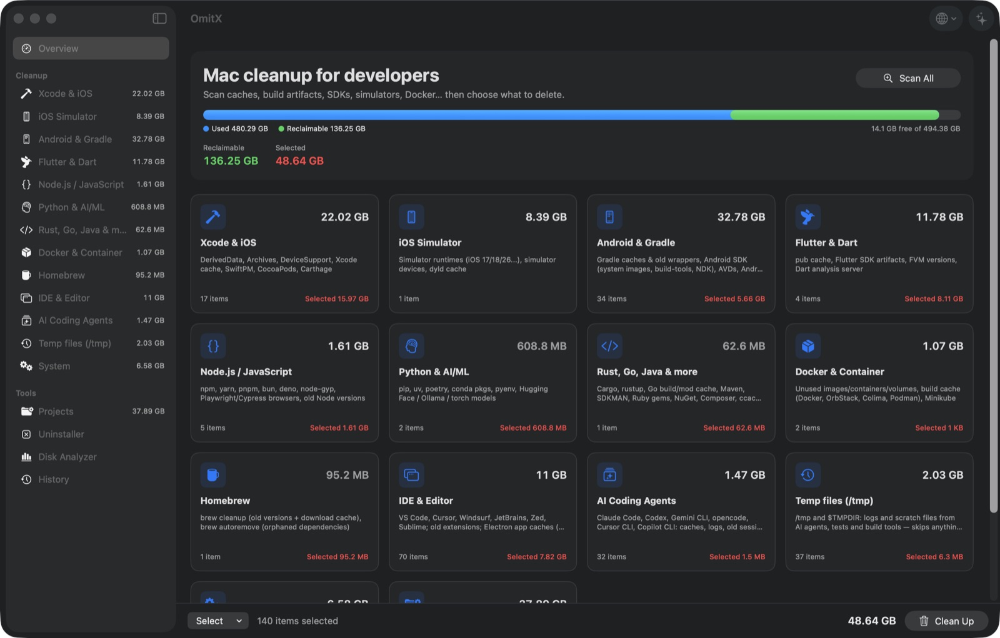

# OmitX

Deep disk cleanup for macOS developers — Xcode, simulators, Android, Flutter, Node, Python, Docker, Homebrew and IDE caches in one native app, plus a complete app uninstaller and a disk analyzer.



## Install

Requires macOS 14+ and Swift 5.10+ (Xcode 16 or Command Line Tools).

```bash
./scripts/build-app.sh --install            # build → /Applications
./scripts/build-app.sh --arch arm64,x86_64  # one app per architecture, never a fat binary
swift run                                   # development
```

Grant **Full Disk Access** so OmitX can measure Trash, Mail, iPhone backups and other apps' containers.

This repository builds the community edition: everything above, with the Pro screens showing an
activation prompt. Official Pro builds are signed with a Developer ID, notarized by Apple and
distributed from [omitx.nviai.com](https://omitx.nviai.com).

## What it cleans

| Module | Covers |
|---|---|
| `xcode` | DerivedData per project, DeviceSupport, Archives, Previews, SwiftPM, CocoaPods, Carthage |
| `simulator` | Simulator runtimes (`simctl`), unavailable and orphaned devices, dyld cache |
| `android` | Gradle caches and old wrappers, SDK system images, NDK, build-tools, AVDs, Android Studio caches |
| `flutter` | pub cache, `bin/cache`, FVM versions, Dart analysis server |
| `javascript` | npm, yarn, pnpm, bun, deno, Playwright/Puppeteer/Cypress, old nvm/fnm/volta/asdf versions |
| `python` | pip, uv, poetry, pdm, conda envs, pyenv, Hugging Face / Ollama / LM Studio models |
| `languages` | Cargo, rustup, Go, Maven, SDKMAN, Ruby, NuGet, Composer, ccache, Bazel |
| `docker` | Build cache, images, containers, volumes; Podman, Colima, Lima, Minikube |
| `homebrew` | `brew cleanup --prune=all`, `brew autoremove` |
| `ide` | VS Code / Cursor / Windsurf / JetBrains caches, obsolete extensions, Electron app caches |
| `ai-agents` | Claude Code, Codex, Gemini CLI, opencode, Cursor CLI, Copilot CLI: caches, logs, old session transcripts (config, auth and memory are kept) |
| `temp` | `/tmp` and `$TMPDIR` leftovers from agents, test runners and build tools — only your own entries with no socket, not open in any process (`lsof`) and unchanged for an hour |
| `system` | User and system caches, logs, saved application state, Trash, iPhone backups, `.ipsw` |
| `projects` | Scans your work folders for `node_modules`, `build/`, `Pods`, `target/`, `.venv`… untouched for N days |

Plus an **uninstaller** that removes an app with every leftover in `~/Library` and `/Library`, and a **disk analyzer** that browses folders by size.

## Safety

- Every item is rated Safe / Review / Risky. Only Safe is preselected; Risky requires an explicit acknowledgement.
- A confirmation sheet lists each path and command before anything runs. Delete permanently or move to Trash.
- Protected paths (`/`, `~`, `~/Library`, `~/Documents`, `/System`, `~/.ssh`, keychains) are never deleted, symlinks are never followed, and paths shared between modules count once.
- Warns when Xcode, Android Studio, an editor or an emulator is running.

## CLI

```bash
OmitX --scan-report              # scan everything, print sizes, delete nothing
OmitX --scan-report xcode docker # selected modules only
```

## Localization

35 translations covering all 40 macOS locales, driven by `Localization/Localizable.xcstrings`. Source keys are the Vietnamese strings in the code.

```bash
python3 scripts/l10n.py extract        # code → catalog
python3 scripts/l10n.py export         # catalog → Localization/source.json
# translate into Localization/translations/<lang>.json
python3 scripts/l10n.py validate de ja
python3 scripts/l10n.py import
```

## Contributing

- New location to clean: add a `PathSpec(home: "…", "Name", group: "…")` to the matching file in `Sources/OmitX/Modules/`.
- New module: add a struct conforming to `CleanModule` and register it in `AppState.cleanModules`.
- `swift test` runs against temporary directories.

## License

Copyright (C) 2026 pha.le

OmitX is free software: you can redistribute it and/or modify it under the terms of the
**GNU General Public License, version 3** (GPL-3.0-only) — see [LICENSE](LICENSE).

Building from this repository gives you the full community edition. The paid features
(the chat assistant and background automation) live in a separate closed-source package and
ship only in the official OmitX Pro builds, which the copyright holder distributes under
separate terms.
